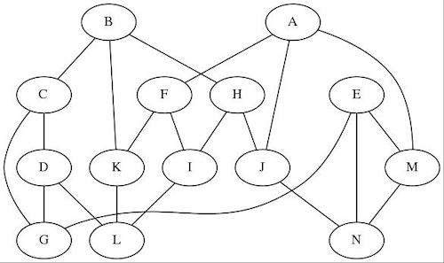

Objectif

Vous avez réussi à vous procurer la carte ci-dessous montrant différents temples reliés par d'antiques lignes telluriques. Les noms (indiqués ici par des lettres de A à N) sont donnés dans une langue oubliée.

La carte donne aussi le nom du Temple Perdu. Comme il est fourni en langue oubliée, vous ne pouvez savoir où il se trouve dans le monde d'aujourd'hui. Mais heureusement, vous disposez d'une carte du même réseau, rédigée dans une langue plus récente. Il suffit d'identifier les temples de la carte récente avec les temples de la carte antique pour trouver le Temple Perdu !

Votre travail est d'écrire un programme prenant en entrée la carte moderne et calculant pour chaque temple indiqué sur la carte à quel temple il correspond sur la carte ancienne et d'en déduire le nom actuel Temple Perdu dont vous connaissez le nom ancien.

Données

Entrée
Ligne 1 : Une lettre entre A et N indiquant l'emplacement du temple perdu sur la vieille carte !
Lignes 2 à 22 : deux chaines contenant entre 5 et 30 caractères alphabétiques séparées par un espace représentant les noms de deux temples connectés sur la nouvelle carte.

Sortie

Le nom, sur la nouvelle carte, du temple correspondant au temple perdu !

Exemple

Entrée

A
Earaindir Rithralas
Hilad Fioldor
Delanduil Rithralas
Urarion Elrebrimir
Elrebrimir Fioldor
Eowul Fioldor
Beladrieng Anaramir
Urarion Eowul
Earaindir Sanakil
Delanduil Isilmalad
Earylas Isilmalad
Rithralas Sanakil
Unithral Elrebrimir
Earylas Eowul
Beladrieng Hilad
Isilmalad Sanakil
Unithral Earylas
Earaindir Anaramir
Unithral Beladrieng
Hilad Anaramir
Delanduil Urarion

Sortie

Delanduil

Dans cet exemple, vous identifiez ainsi que les lettres correspondent aux temples suivants :

A -> Delanduil
B -> Unithral
C -> Beladrieng
D -> Hilad
E -> Earaindir
F -> Urarion
G -> Anaramir
H -> Earylas
I -> Eowul
J -> Isilmalad
K -> Elrebrimir
L -> Fioldor
M -> Rithralas
N -> Sanakil

Le temple perdu, identifié ici par la lettre A correspond donc à Delanduil.
